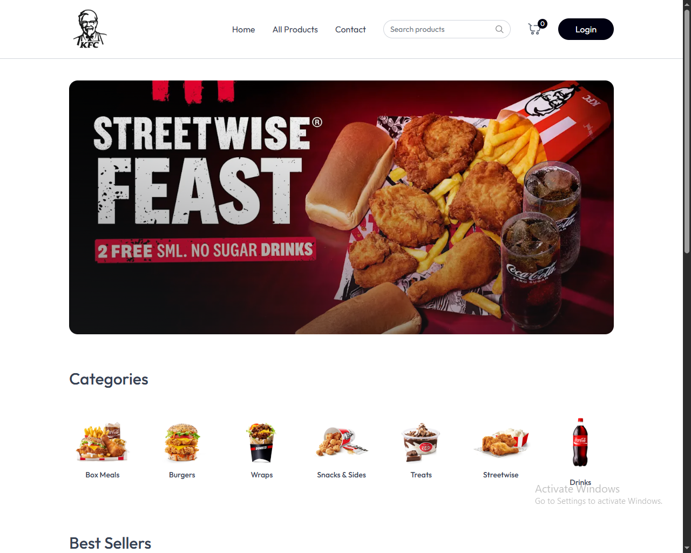

# 🍗 KFC Delivery Application

<h3 align="center">
A Full-Stack MERN Food Delivery Platform
</h3>

<p align="center">
Built with React, Node.js, Express, and MongoDB.
</p>

<p align="center">
  <a href="https://kfc-delivery-application.vercel.app">
    
  </a>
  <a href="https://kfc-delivery-application-server.vercel.app">
    
  </a>
</p>

<p align="center">
  
  
  
  
  
</p>

---

## 📖 Overview

The KFC Delivery Application is a production-style MERN stack application that replicates the experience of ordering food through a modern restaurant delivery platform.

The application demonstrates full-stack development principles including API design, database integration, responsive user interfaces, component-based architecture, and cloud deployment.

---

## ✨ Features

### Customer Features

* Browse menu items
* View product details
* Add items to cart
* Update quantities
* Remove items from cart
* Place orders
* Responsive mobile experience

### Technical Features

* RESTful API architecture
* MongoDB integration
* Component-based React architecture
* Express backend services
* Error handling and validation
* Environment variable configuration
* Production deployment with Vercel

---

## ⚡ Technology Stack

| Layer           | Technology   |
| --------------- | ------------ |
| Frontend        | React.js     |
| Backend         | Node.js      |
| Framework       | Express.js   |
| Database        | MongoDB      |
| ODM             | Mongoose     |
| HTTP Client     | Axios        |
| Deployment      | Vercel       |
| Version Control | Git & GitHub |

---

## 📸 Application Preview

<h3 align="center">🏠 Home Page</h3>

<p align="center">
  
</p>

---

## 🏗️ Architecture

```text
React Client
     │
     ▼
Express API
     │
     ▼
MongoDB Database
```

### Request Flow

1. User interacts with the React application.
2. Frontend sends requests to the Express API.
3. API processes business logic.
4. MongoDB stores and retrieves data.
5. Updated data is returned to the user interface.

---

## 🎓 Skills Demonstrated

* Full-Stack Development
* REST API Design
* Database Modelling
* Responsive Design
* State Management
* Production Deployment
* Software Architecture
* Component-Based Development
* Problem Solving

---

## 📂 Project Structure

```bash
KFC-delivery-application
│
├── assets
├── client
├── server
└── README.md
```

---

## ⚙️ Installation

```bash
git clone https://github.com/coffee-driven-dev007/KFC-delivery-application.git

cd KFC-delivery-application

# Frontend
cd client
npm install

# Backend
cd ../server
npm install
```

---

## 🔐 Environment Variables

```env
PORT=5000

MONGODB_URI=your_mongodb_connection_string

JWT_SECRET=your_secret_key
```

---

## ▶️ Run Locally

### Backend

```bash
cd server
npm run dev
```

### Frontend

```bash
cd client
npm start
```

---

## 🚧 Engineering Challenges

### Frontend & Backend Integration

Implemented asynchronous communication between React and Express while maintaining clean separation of concerns.

### Database Design

Designed MongoDB schemas to support menu management and order processing workflows.

### Responsive Design

Built a consistent user experience across desktop, tablet, and mobile devices.

### Deployment

Configured and deployed frontend and backend services while managing production environment variables.

---

## 📈 Future Improvements

* Authentication & Authorization
* Online Payments
* Real-Time Order Tracking
* Push Notifications
* Admin Dashboard
* Driver Management
* Analytics & Reporting

---

## 👨‍💻 Author

### James Matsheni

Full-Stack MERN Developer focused on building scalable systems and solving real-world problems through software.

GitHub: https://github.com/coffee-driven-dev007

---

## ⭐ Support

If you found this project interesting, consider starring the repository.

---

## 📄 License

MIT License

---

<p align="center">
Built with ❤️ by James Matsheni
</p>
